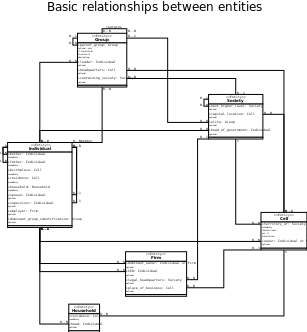

Entity-types in the copan\:CORE base model
==========================================

Entity or attribute?
--------------------

We try to keep the number of explicitly considered entity types manageably small
and thus choose to model some relevant things that occur in the real world not as separate entities
but rather as *attributes* of other entities.

As a rule of thumb, things that can occur in *large, a priori unknown numbers* (e.g., individuals)
will be modeled as entities,
whereas things that typically occur *only once for each entity of some type* (e.g., an individual's bank account)
are modeled as attributes of the latter entity-type.

A notable exception is the entity type *"world"*. 
Although it will typically have only one instance (planet Earth),
it is introduced so that all other things a model considers to be *singular* 
(e.g., the global trade network or the well-mixed atmospheric carbon stock) 
can be modelled as attributes of the world entity.

In addition to the entity-type :doc:`"world"<world>`, 
the copan\:CORE base model currently provides the three main entity-types :doc:`"cell"<cell>`, :doc:`"society"<society>`, and :doc:`"individual"<individual>`
that are meant to be the main subjects and objects 
of the three process taxons :doc:`"nature"<../process_taxonomy/nature>`, :doc:`"social metabolism"<../process_taxonomy/social_metabolism>`, and :doc:`"culture"<../process_taxonomy/culture>`,
although modelers are free to attach, say, a cultural process to a society or cell, or a natural process to an indivudual, etc. 

In addition to these, we provide three further entity-types :doc:`"household"<household>`, :doc:`"group"<group>` and :doc:`"firm"<firm>` 
since they will likely be needed by some more detailed socio-metabolic model components.

Basic relationships
-------------------

The following UML diagram shows the basic relationships 

(`pdf version`_)

.. _`pdf version`: basic_relationships.pdf

Contents:

.. toctree::
   :maxdepth: 2

   world
   cell
   society
   individual
   household
   group
   firm
